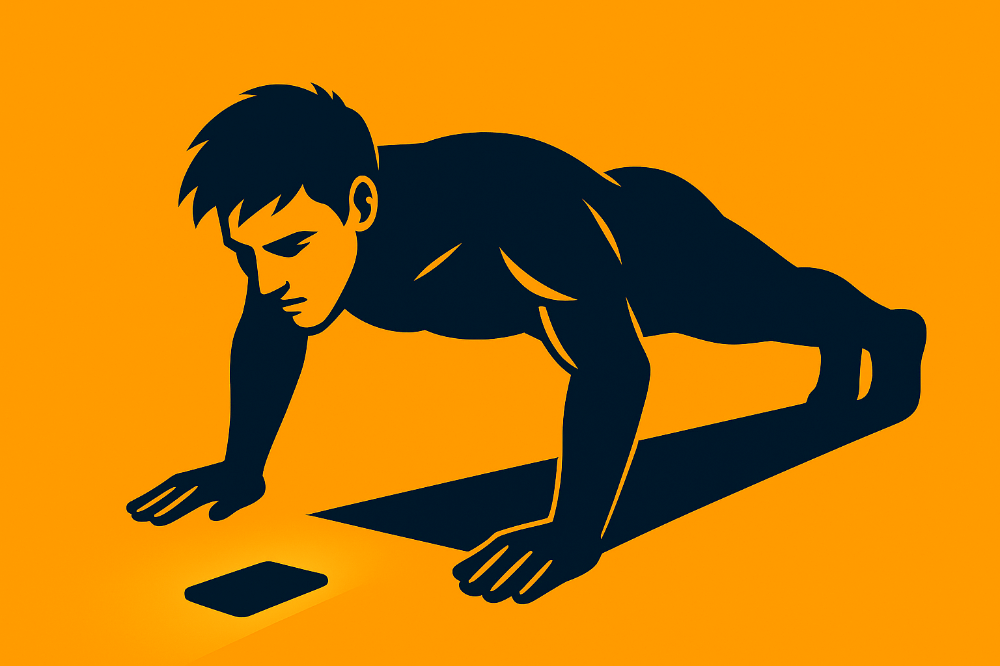

<div align="center">


# Push Pro

**Automatic push-up counter for Android & iOS**

[](https://reactnative.dev)
[](#)
[](#)

**[🌐 View Showcase Website](https://push-pro-web.vercel.app)**

</div>

---

## ✨ Features

| Feature | Description |
|---|---|
| 📷 **Auto Rep Counting** | Just drop your phone, get in position, and it counts for you — no buttons, no interruptions |
| 📊 **Workout History** | Every session is saved so you can look back, see how far you've come, and keep pushing |
| 🔊 **Voice Feedback** | Hear your rep count called out loud — no need to glance at the screen mid-set |
| 🎵 **Audio Cues** | A satisfying sound on every rep, with volume you can dial in however you like |
| 💬 **Motivational Coach** | When it gets hard, the app gets louder — 60+ no-nonsense messages to push you through |
| 🌙 **Dark / Light Mode** | Looks great day or night, with a bold orange theme that matches the grind |
| 📳 **Haptic Feedback** | A quick buzz on each rep so your phone feels as locked in as you are |

---

## 📸 Use-case

<div align="center">


&nbsp;&nbsp;


</div>

---

## 🛠️ Tech Stack

- **React Native 0.80** + TypeScript
- **Vision Camera v4** — frame-by-frame camera processing
- **Worklets Core** — off-thread frame processing for zero-lag counting
- **NativeWind** (Tailwind CSS) — utility-first styling
- **React Navigation** — stack + bottom tabs
- **SQLite** — local persistent workout history
- **React Native TTS + Sound** — voice & audio feedback
- **Skia** — smooth animated visuals

---

## 🚀 Getting Started

### Prerequisites
- [React Native environment set up](https://reactnative.dev/docs/set-up-your-environment)
- Node.js ≥ 18, Ruby (for iOS)

### Install

```sh
git clone https://github.com/NikhilRW/push_pro.git
cd push_pro
npm install
```

### Android

```sh
npm run android
```

### iOS

```sh
bundle install
bundle exec pod install
npm run ios
```

---

## 📖 How to Use

1. Place your phone on a flat surface, front camera facing you.
2. Align yourself so **both hands and your face** are visible.
3. Hit **▶ Play** — the app starts counting automatically.
4. Your rep count is announced aloud after each push-up.
5. Check **History** to review all past sessions.

---

## 📄 License

MIT © [NikhilRW](https://github.com/NikhilRW)
